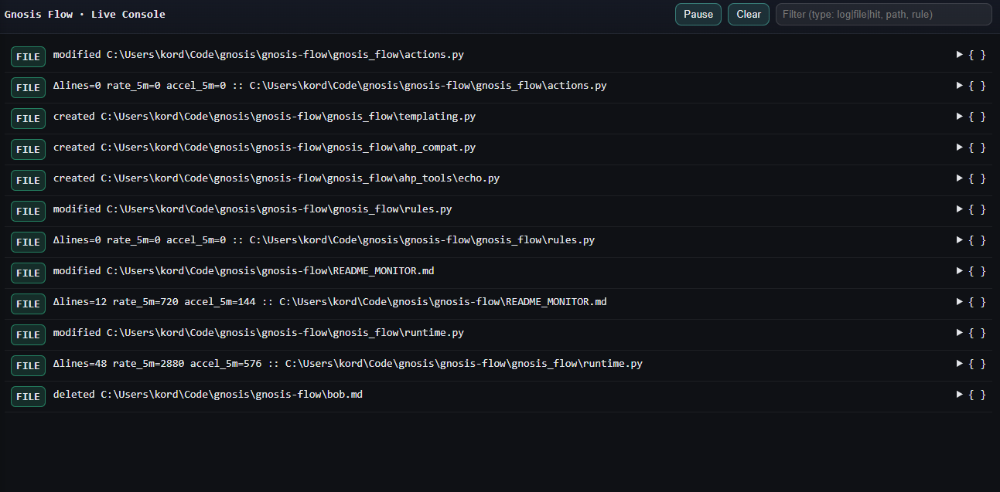

# Gnosis Flow Active Agents

[](https://www.python.org/downloads/release/python-390/)
[](https://opensource.org/licenses/MIT)



Gnosis Flow is an async file/log monitor with a live console and in‑process tools. It watches your project, matches events via rules, and triggers actions (e.g., append to a file, echo, future safe edits), all without external services.

## Install

PyPI (when published):

```bash
pip install gnosis-flow
```

From this repo (development):

```bash
cd gnosis-flow
pip install -e .
```

Optional MCP extras (for the separate MCP connector CLI):

```bash
pip install -e .[mcp]
```

## Run

Start in your project directory and enable the HTTP console:

```bash
gnosis-flow start --dir . --http
```

- First run creates `.gnosis-flow/` and `rules.yaml`. If your repo uses Git, it offers to add `.gnosis-flow` to `.gitignore`.
- Control server: `127.0.0.1:8765`
- Live console (SSE): `http://127.0.0.1:8766/console`
- JSON status: `http://127.0.0.1:8766/status`

Expose on your network (optional):

```bash
gnosis-flow start --dir . --http --host 0.0.0.0 --http-port 8766
```

Runtime control (in another terminal):

```bash
gnosis-flow add-log ./app.log
gnosis-flow add-watch ./src
gnosis-flow status
gnosis-flow stop
```

Demo (PowerShell)
- Run a local demo that creates/modifies/deletes files under the repo so you can see events in the live console:

```powershell
PowerShell -ExecutionPolicy Bypass -File .\demo.ps1
```

The script creates a `scratch_demo` directory, writes a file, creates a subdir, deletes both, and exits.

## Rules

Rules live in `.gnosis-flow/rules.yaml` and are loaded at startup (hot‑reload APIs coming next). The default file includes examples for log ERRORs and a demo tool on `.py` changes.

Example: notify on ERROR lines and append a line on any `.py` change.

```yaml
rules:
  - name: Errors in logs
    include: ["**/*.log"]
    regex: "(ERROR|CRITICAL)"
    lines_before: 2
    lines_after: 5
    action:
      type: notify

  - name: Append on py change
    include: ["**/*.py"]
    regex: "def \w+\("
    action:
      type: ahp_tool
      name: file.append_line
      args:
        path: "./flow.log"
        line: "Changed {{path}}"
```

Templating supports `{{path}}`, `{{line}}`, `{{rule}}`, and fields from rule hits (e.g., similarity) when present.

## Tools (In‑Process, no external services)

Built‑in AHP‑style tools live under `gnosis_flow/ahp_tools/` and are auto‑registered:

- `echo.text(text, prefix="")`
- `file.append_line(path, line)`

Add your own tools by creating a file under `gnosis_flow/ahp_tools/` and decorating functions with our lightweight `@tool` decorator.

```python
from gnosis_flow.ahp_compat import tool

@tool(name="example.say")
def say(msg: str) -> str:
  return msg
```

If `gnosis-ahp` is installed, Gnosis Flow will use its full tool registry seamlessly.

## Live Console

Open `http://127.0.0.1:8766/console` to see:

- FILE events: created/modified/deleted, with Δlines and (+added/−deleted) for small files
- LOG lines (tailed)
- HIT entries when a rule matches
- JSON expanders to view the full event payload

Use the Pause/Clear/Filter controls to focus on specific paths, rules, or types.

## Code Relationship Graph

The console includes a Graph panel that queries a live, local code relationship graph.

### Graph Panel

- Edge types: `dir_sibling`, `import_dep`, `co_activity`, optionally `shared_tokens`, `term_ref`.
- Enter a path, toggle edge types, set min weight and limit, then Query.
- Results show neighbor path, weight, count, and explanation.

### Indexing the Graph

The graph builds edges lazily. To speed up queries (especially on larger repos), you can pre‑warm the index:

- Windows (recommended): run the indexing script with progress and ETA

```powershell
PowerShell -ExecutionPolicy Bypass -File .\scripts\index-graph.ps1
```

- What it does: walks `*.py` files and materializes `import_dep`, `shared_tokens`, and `term_ref` edges with a low per‑file limit to touch everything quickly. It prints progress and a summary.
- Options (defaults shown):

```powershell
PowerShell -ExecutionPolicy Bypass -File .\scripts\index-graph.ps1 -Types "import_dep,shared_tokens,term_ref" -Limit 1 -Include "*.py" -Dir "."
```

Notes:
- `dir_sibling` is computed on demand; no indexing needed.
- `co_activity` is live only (based on file events as you work).
- You can rerun the script anytime to refresh after large edits.

### Searching the Graph

You can search for files in the graph using the CLI or the HTTP API.

**CLI:**

```bash
gnosis-flow graph search "your search query"
```

**HTTP API:**

```bash
curl -s "http://127.0.0.1:8766/graph/search?q=your%20search%20query" | jq
```

### Graph CLI Commands

```bash
gnosis-flow graph neighbors path/to/file.py --types dir_sibling,import_dep,co_activity --min-w 0.1 --limit 20
gnosis-flow graph why path/to/a.py path/to/b.py
```

### Graph HTTP Endpoints

- `/graph/edge-types`, `/graph/node?path=<rel>`, `/graph/neighbors?path=<rel>&types=...&min_w=...&limit=...`, `/graph/why?src=<a>&dst=<b>`, `/graph/search?q=...`, `/graph/metrics`.

## MCP (optional)

The separate MCP connector (`gnosis-flow-mcp`) exposes monitor control tools to MCP clients. Install with extras:

```bash
pip install -e .[mcp]
gnosis-flow-mcp
```

Tools: `gf_status`, `gf_add_watch`, `gf_add_log`, `gf_stop`, `gf_rules`.

## Config

You can control extra excludes via a small config file. A template is provided at `config.yaml` in this repo.

- Copy it into your project’s state folder: `.gnosis-flow/config.yaml`.
  - Windows (PowerShell): `Copy-Item .\config.yaml .\.gnosis-flow\config.yaml`
  - macOS/Linux: `cp config.yaml .gnosis-flow/config.yaml`
- Supports `exclude_names` (merged with built-in defaults like `.git`, `node_modules`, `__pycache__`, etc.).

Graph settings (optional) under `.gnosis-flow/config.yaml`:

```yaml
graph:
  enabled: true
  edge_types: [dir_sibling, import_dep, co_activity]
  co_activity:
    window_sec: 900
  decay:
    tau_sec: 86400
  shared_tokens:
    enabled: false
    max_file_kb: 256
  terms:
    enabled: false
    list: ["kafka", "redis", "payment"]
```

## Notes

- Excludes: `.gnosis-flow/`, `.git/`, `node_modules/`, `.venv/` are excluded by default.
- Windows: if using the HTTP console, allow the app through the firewall when prompted.
- Large files: snapshots (for +/- line counts) are taken only for small files to avoid heavy IO.

## License

MIT — see [LICENSE](LICENSE).